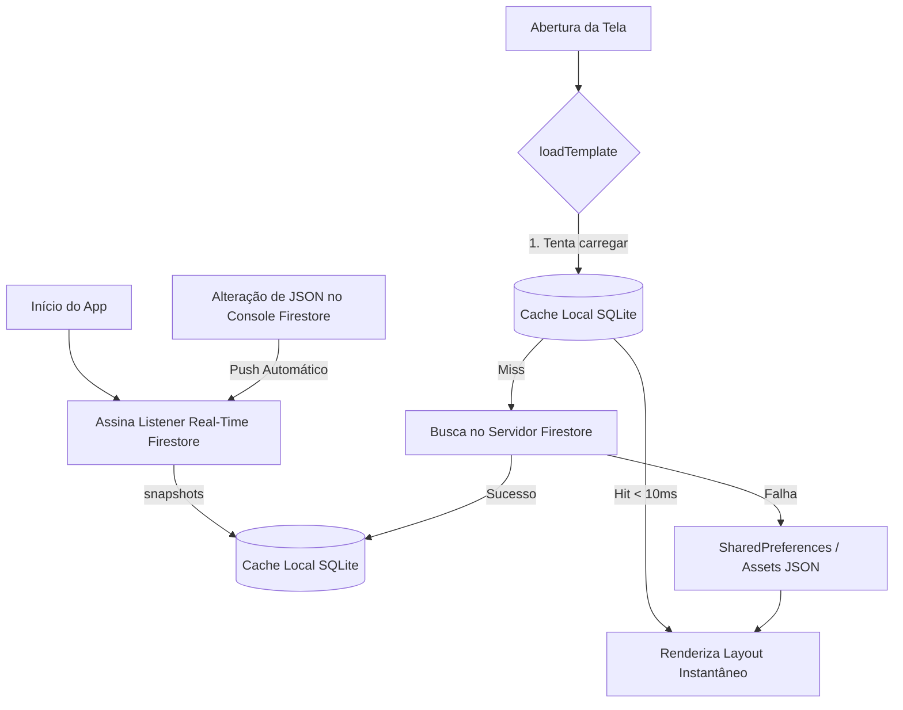

# Hibridismo Dinâmico: SDUI com Google Cloud Firestore & Flutter

Este repositório contém uma Prova de Conceito (POC) de arquitetura **Server-Driven UI (SDUI)** integrada ao **Google Cloud Firestore** e ao **Flutter**, utilizando conceitos de cache local inteligente e sincronização de dados em tempo real.

O principal objetivo deste projeto é construir uma aplicação móvel híbrida onde aproximadamente **65% do projeto seja construído em Flutter nativo** e **35% seja dinamicamente carregado via arquivos JSON** estruturados no Firestore, permitindo atualizar layouts, fluxos e elementos visuais sem a necessidade de novos deploys nas lojas (Google Play / App Store).

---

## 🏗️ Arquitetura do Projeto

O projeto é dividido em três componentes principais:

```
sdui-with-firestore/
├── sdui_with_firestore/    # Aplicativo móvel híbrido em Flutter
├── seed/                   # Script de automação e carga de templates JSON em Node.js
└── Api/                    # Recursos de API REST de dados (Postman Collection)
```

### 📦 Detalhamento dos Componentes

1. **`sdui_with_firestore` (Flutter App)**:
   Contém o motor de renderização dinâmica (`SduiEngine`) responsável por processar e renderizar os nós visuais (Screen, Card, Column, Row, Text, Image, List) a partir dos contratos JSON, unindo-os com os dados recebidos das APIs REST de negócios em tempo de execução (*data-binding*).
   
2. **`seed` (Node.js Seed Utility)**:
   Ferramenta de linha de comando para ler, validar a sintaxe e fazer o upload dos arquivos JSON das telas (`product_detail.json`, `product_filter.json` e `product_list.json`) para a coleção `sdui_templates` no Firestore. Funciona tanto com o **Firestore Emulator** local quanto com o Firestore em nuvem.
   
3. **`Api` (Coleção REST)**:
   Contém arquivos de suporte (coleções do Postman em `postman.json`) documentando as APIs REST utilizadas como fontes de dados de negócios (neste exemplo, simulando um e-commerce com a Fake Store API do *Platzi Escuelas*).

---

## ⚡ Fluxo de Dados e Estratégia de Cache Otimizada (Cache-First)

Para garantir que a renderização do layout ocorra sem atrasos de rede e funcione perfeitamente **offline**, implementamos um fluxo de **Cache-First com Sincronização em Tempo Real (Snapshots)**:



### Benefícios desta abordagem:
- **Zero Latência de Rede na Navegação**: O app carrega os templates do disco local instantaneamente (menos de 10ms).
- **Consumo de Banda Reduzido**: Navegar de volta para uma tela não consome chamadas do servidor.
- **Sincronização Passiva**: Sempre que um template é atualizado no Firestore, o listener recebe a atualização silenciosamente e a salva localmente para a próxima renderização.

---

## 🚀 Como Executar o Projeto Localmente

Siga o passo a passo a seguir para rodar toda a suíte de testes locais utilizando o **Firestore Emulator**.

### Passo 1: Pré-requisito (Instalar Java para o Emulador)
O Firestore Emulator exige o Java Runtime para rodar. No macOS, instale o OpenJDK pelo Homebrew:
```bash
brew install openjdk
```
Para que o sistema operacional encontre o Java instalado pelo Homebrew, exporte as variáveis no seu terminal ou salve no seu shell (`~/.zshrc`):
```bash
echo 'export PATH="/opt/homebrew/opt/openjdk/bin:$PATH"' >> ~/.zshrc
source ~/.zshrc
```

---

### Passo 2: Inicializar o Firebase Emulator
Navegue até a pasta `seed` e instale as dependências. Em seguida, inicie o emulador do Firestore na raiz do projeto:
```bash
# Entre na pasta do seed e instale as ferramentas necessárias
cd seed
npm install

# Inicie o emulador Firestore (da raiz do projeto ou dentro de 'seed')
npx firebase emulators:start --only firestore
```
Isso iniciará:
- O Firestore local na porta `8080` (usada pelo app e pelo seed).
- A interface gráfica de gerenciamento (Emulator UI) em `http://127.0.0.1:4000`.

---

### Passo 3: Rodar o Script de Seed
Com o emulador rodando no terminal anterior, abra uma nova janela de terminal, entre na pasta `seed` e envie os templates SDUI para o banco:
```bash
cd seed
npm run seed -- -e
```
*O parâmetro `-e` (ou `--emulator`) avisa ao script para conectar no emulador local em vez de buscar credenciais de produção.*

---

### Passo 4: Executar o Aplicativo Flutter
Com os templates salvos com sucesso no banco de dados local, entre no diretório do Flutter e execute o app:
```bash
cd sdui_with_firestore
flutter pub get
flutter run
```

---

## 🎨 Estrutura do Documento de Layout no Firestore

Cada documento na coleção `sdui_templates` representa um layout de tela. Exemplo de estrutura do documento `product_detail` gerado pelo seed:

```json
{
  "template": {
    "type": "screen",
    "appBar": {
      "title": "Detalhe do Produto",
      "backgroundColor": "primary"
    },
    "body": {
      "type": "column",
      "children": [
        {
          "type": "image",
          "src": "${images[0]}",
          "width": 220,
          "height": 220,
          "fit": "cover"
        },
        {
          "type": "text",
          "text": "${title}"
        },
        {
          "type": "text",
          "text": "Preço: ${price}"
        }
      ]
    }
  },
  "updatedAt": "Timestamp"
}
```
*Nota: Marcadores como `${title}` e `${price}` são substituídos dinamicamente pelo `SduiEngine` em tempo de execução pelos dados correspondentes vindos das APIs.*
