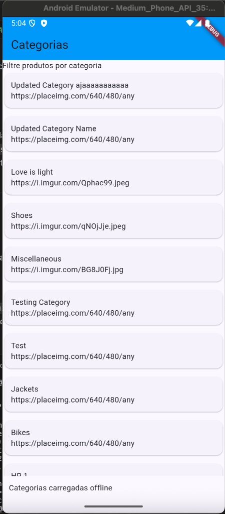
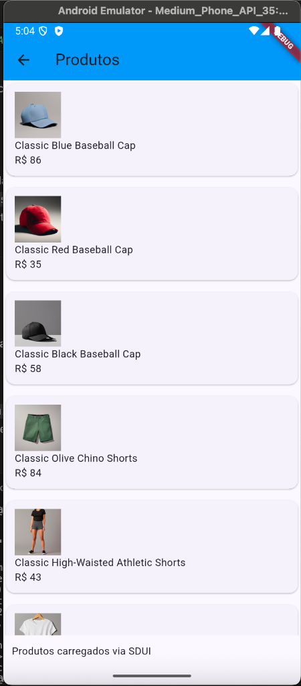
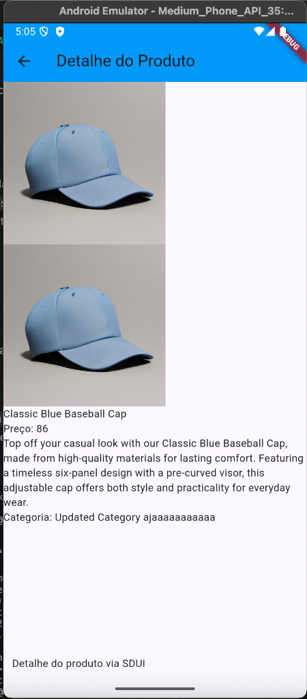
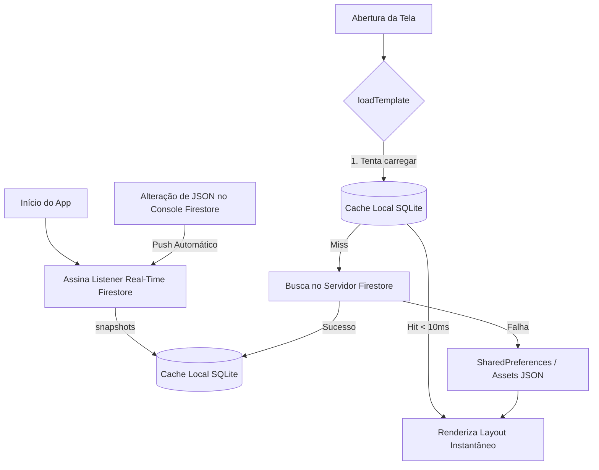
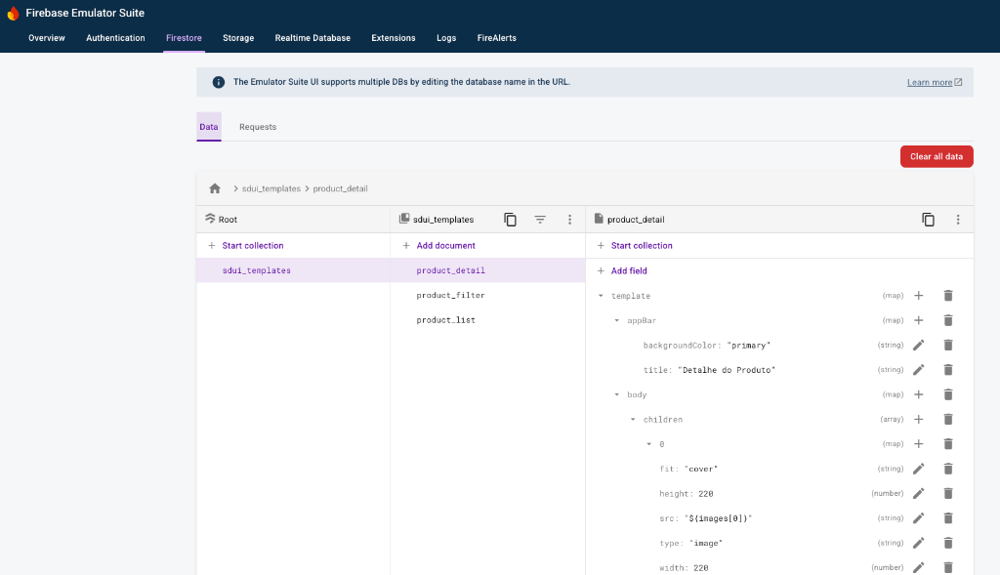
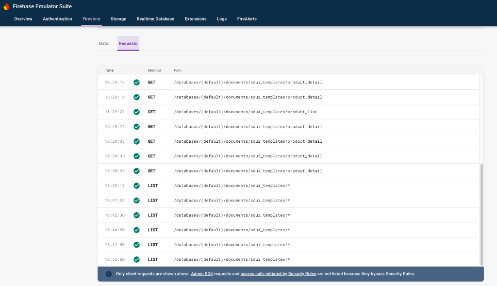

# Hibridismo Dinâmico: SDUI com Google Cloud Firestore & Flutter

Este repositório contém uma Prova de Conceito (POC) de arquitetura **Server-Driven UI (SDUI)** integrada ao **Google Cloud Firestore** e ao **Flutter**, utilizando conceitos de cache local inteligente e sincronização de dados em tempo real.

O principal objetivo deste projeto é construir uma aplicação móvel híbrida onde aproximadamente **65% do projeto seja construído em Flutter nativo** e **35% seja dinamicamente carregado via arquivos JSON** estruturados no Firestore, permitindo atualizar layouts, fluxos e elementos visuais sem a necessidade de novos deploys nas lojas (Google Play / App Store).

---

## 🏗️ Arquitetura do Projeto

O projeto é dividido em três componentes principais:

```
sdui-with-firestore/
├── sdui_with_firestore/    # Aplicativo móvel híbrido em Flutter
├── seed/                   # Script de automação e carga de templates JSON em Node.js
└── Api/                    # Recursos de API REST de dados (Postman Collection)
```

### 📱 Telas do Aplicativo (Renderização SDUI)

Aqui está a demonstração visual das telas renderizadas pelo aplicativo Flutter de forma dinâmica com base nos JSONs carregados do Firestore:

| 1. Filtro de Categorias (Home) | 2. Lista de Produtos por Categoria | 3. Detalhes do Produto |
| :---: | :---: | :---: |
|  |  |  |

- **Categorias (Home)**: Renderiza um filtro dinâmico de categorias buscadas da API e alimentadas para o layout SDUI. O rodapé indica o carregamento em cache local.
- **Lista de Produtos**: Carrega a lista com imagens, títulos e preços das mercadorias, exibindo o indicador de carregamento via SDUI.
- **Detalhes do Produto**: Exibe imagens e informações detalhadas estruturadas em colunas dinâmicas alimentadas por placeholders de data-binding.

---

## ⚡ Fluxo de Dados e Estratégia de Cache Otimizada (Cache-First)

Para garantir que a renderização do layout ocorra sem atrasos de rede e funcione perfeitamente **offline**, implementamos um fluxo de **Cache-First com Sincronização em Tempo Real (Snapshots)**:



### Benefícios desta abordagem:
- **Zero Latência de Rede na Navegação**: O app carrega os templates do disco local instantaneamente (menos de 10ms).
- **Consumo de Banda Reduzido**: Navegar de volta para uma tela não consome chamadas do servidor.
- **Sincronização Passiva**: Sempre que um template é atualizado no Firestore, o listener recebe a atualização silenciosamente e a salva localmente para a próxima renderização.

---

### 🗃️ Banco de Dados & Logs de Consulta (Firestore Emulator)

Para validar a otimização de Cache-First e a eliminação de requisições GET redundantes, observe as capturas do **Firebase Emulator Suite**:

#### 1. Coleções no Firestore
Demonstra os templates salvos na coleção `sdui_templates` sob o formato `{ template: Map, updatedAt: Timestamp }`:



#### 2. Log de Requisições do Firestore
Exemplo de log de conexões onde a navegação ocorre de forma transparente consumindo apenas o cache local, sem disparar requisições GET constantes para o servidor gRPC a cada transição de tela:



---

## 🚀 Como Executar o Projeto Localmente

Siga o passo a passo a seguir para rodar toda a suíte de testes locais utilizando o **Firestore Emulator**.

### Passo 1: Pré-requisito (Instalar Java para o Emulador)
O Firestore Emulator exige o Java Runtime para rodar. No macOS, instale o OpenJDK pelo Homebrew:
```bash
brew install openjdk
```
Para que o sistema operacional encontre o Java instalado pelo Homebrew, exporte as variáveis no seu terminal ou salve no seu shell (`~/.zshrc`):
```bash
echo 'export PATH="/opt/homebrew/opt/openjdk/bin:$PATH"' >> ~/.zshrc
source ~/.zshrc
```

---

### Passo 2: Inicializar o Firebase Emulator
Navegue até a pasta `seed` e instale as dependências. Em seguida, inicie o emulador do Firestore na raiz do projeto:
```bash
# Entre na pasta do seed e instale as ferramentas necessárias
cd seed
npm install

# Inicie o emulador Firestore (da raiz do projeto ou dentro de 'seed')
npx firebase emulators:start --only firestore
```
Isso iniciará:
- O Firestore local na porta `8080` (usada pelo app e pelo seed).
- A interface gráfica de gerenciamento (Emulator UI) em `http://127.0.0.1:4000`.

---

### Passo 3: Rodar o Script de Seed
Com o emulador rodando no terminal anterior, abra uma nova janela de terminal, entre na pasta `seed` e envie os templates SDUI para o banco:
```bash
cd seed
npm run seed -- -e
```
*O parâmetro `-e` (ou `--emulator`) avisa ao script para conectar no emulador local em vez de buscar credenciais de produção.*

---

### Passo 4: Executar o Aplicativo Flutter
Com os templates salvos com sucesso no banco de dados local, entre no diretório do Flutter e execute o app:
```bash
cd sdui_with_firestore
flutter pub get
flutter run
```
